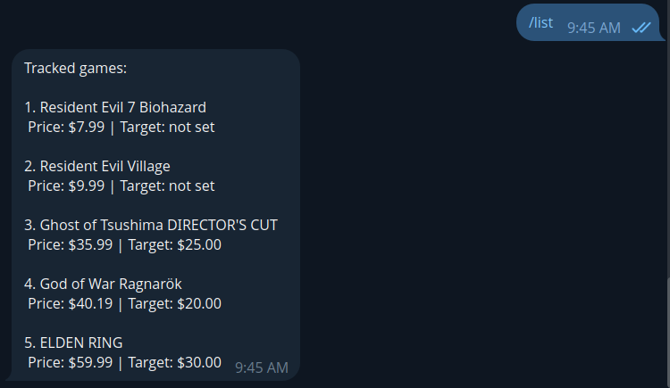

# Game Price Tracker

[](https://github.com/khantuevandrei/game-price-tracker/actions/workflows/ci.yml)
[](https://github.com/khantuevandrei/game-price-tracker/actions/workflows/deploy.yml)


Track Steam game prices and get notified via email or Telegram when a game drops to your target price.

🇷🇺 [Русская версия](README.ru.md)

## 🎮 Live Demo

**Web app:** [steam.khantuev.dev](https://steam.khantuev.dev)
**Telegram bot:** [@GamePriceTrackerTelegramBot](https://t.me/GamePriceTrackerTelegramBot)

Demo account for a quick look:

- Email: `demo@khantuev.dev`
- Password: `demo1234`

## Screenshots

<p align="center">
  
  <br><em>Dashboard — tracked games with current and target prices</em>
</p>

<p align="center">
  
  <br><em>Search — find any game from the Steam catalog</em>
</p>

<p align="center">
  
  <br><em>Telegram notification when a tracked game price drops</em>
</p>

## Features

- 🔍 Search games from the Steam catalog
- 📊 Track price history for every tracked game
- 🎯 Set a target price — get notified when the price drops below it
- 📧 Email notifications via SMTP
- 🤖 Telegram bot commands:
  `/start`, `/search`, `/track`, `/list`, `/price`, `/set`, `/untrack`, `/notify`, `/cancel`, `/email`, `/help`
- 📈 Automatic hourly price refresh via Laravel Scheduler
- 🔐 Auth flow with Laravel Breeze + email verification

## Tech Stack

**Backend:** Laravel 11, PHP 8.5, PostgreSQL 16, Redis
**Frontend:** Blade, Tailwind CSS, Alpine.js
**Infrastructure:** Docker Compose, Caddy (reverse proxy + automatic HTTPS), Ubuntu VPS
**Testing & CI/CD:** PHPUnit, Laravel Pint, GitHub Actions
**External APIs:** Steam Web API, Telegram Bot API

## Architecture

```
        ┌──────────────┐
        │     User     │
        └──────┬───────┘
               │ HTTPS
        ┌──────▼───────┐
        │    Caddy     │  ← Let's Encrypt auto-renew
        └──────┬───────┘
               │
        ┌──────▼───────┐         ┌────────────────┐
        │   Laravel    │ ─────▶️ │  Steam API     │
        │  (Docker)    │ ─────▶️ │  Telegram API  │
        │              │ ─────▶️ │  Resend        │
        └──────┬───────┘         └────────────────┘
               │
     ┌─────────┼─────────┐
     ▼         ▼         ▼
 ┌────────┐ ┌───────┐ ┌──────────┐
 │Postgres│ │ Redis │ │Scheduler │
 └────────┘ └───────┘ └──────────┘
```

## Getting Started

```bash
git clone https://github.com/khantuevandrei/game-price-tracker.git
cd game-price-tracker
cp .env.example .env
docker compose up -d --build
docker compose exec app php artisan key:generate
docker compose exec app php artisan migrate
```

The app is available at `http://localhost:8080`.

### Required environment variables

```env
APP_URL=http://localhost:8080

DB_CONNECTION=pgsql
DB_HOST=postgres
DB_DATABASE=game_price_tracker
DB_USERNAME=laravel
DB_PASSWORD=your_password

REDIS_HOST=redis

TELEGRAM_BOT_TOKEN=your_bot_token

MAIL_MAILER=resend
RESEND_KEY=your_resend_api_key
MAIL_FROM_ADDRESS=noreply@yourdomain.com
MAIL_FROM_NAME="Game Price Tracker"
```

## Tests

```bash
docker compose exec app php artisan test
```

37 tests covering auth flow, Steam API integration, game tracking, and the Telegram bot.

## Code Style

```bash
docker compose exec app vendor/bin/pint
```

Laravel Pint enforces PSR-12. Runs automatically in CI on every push.

## Deployment

Push to `main` → GitHub Actions runs tests + lint → on success, auto-deploys to the VPS via SSH → `git pull` + rebuild containers + cache config/routes/views.

Production runs at [steam.khantuev.dev](https://steam.khantuev.dev) on a self-managed Ubuntu VPS with Caddy handling HTTPS via Let's Encrypt.

## License

MIT
