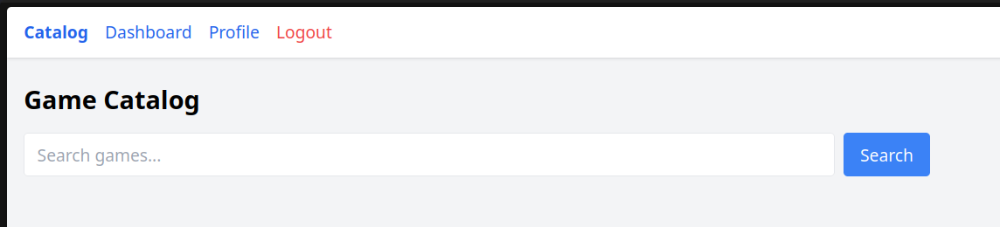
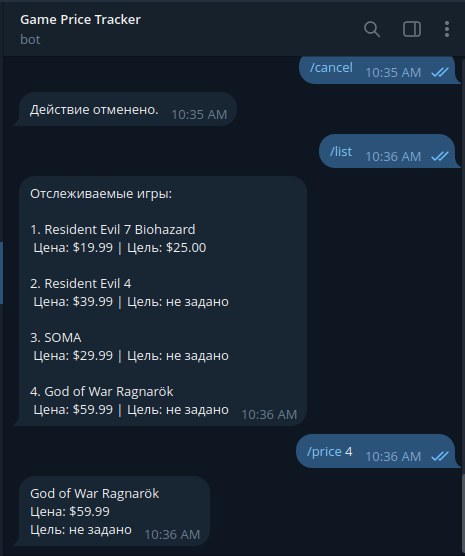
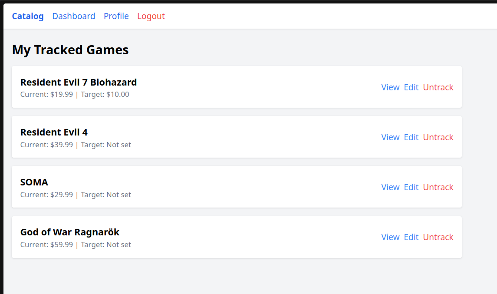

# Game Price Tracker

Track Steam game prices with notifications via Telegram and Email.

Web: https://steam.khanvps.xyz/
Telegram: @GamePriceTrackerTelegramBot


## Features

- **Game search** via Steam (HTML parsing + API).
- **Price chart** on the game page (Chart.js).
- **Notifications** when the price drops below the target (Email + Telegram).
- **Telegram bot** with a set of commands:
    - `/start` — get started.
    - `/search` — search for games.
    - `/track` — add to tracking.
    - `/list` — list of tracked games.
    - `/price` — current price.
    - `/set` — set target price.
    - `/untrack` — remove from tracking.
    - `/notify` — notification settings.
    - `/cancel` — cancel the last command.
    - `/email` — link an email with verification.
    - `/help` — list of available commands.
- **Email notifications** via queues (Redis).
- **Price history** and change chart.
- **Web interface** on Blade with authentication (Breeze).
- **Docker** — one-command startup.

## Stack

- **Backend:** Laravel 13, PHP 8.5
- **Database:** PostgreSQL 16
- **Queue/Cache:** Redis
- **Frontend:** Blade, Chart.js
- **Bot:** Telegram Bot API
- **API:** Steam (appdetails + HTML parsing)
- **Deploy:** Docker, Docker Compose, Nginx, Supervisor

## Screenshots

Catalog


Game page


Telegram bot


Dashboard


## Quick start (local)

​```bash
git clone https://github.com/khantuevandrei/game-price-tracker.git
cd game-price-tracker
cp .env.example .env

## Fill in .env (TELEGRAM_BOT_TOKEN is required)

docker compose up -d --build
docker compose exec app php artisan migrate
docker compose exec app php artisan key:generate
​```

Open: `http://localhost:8080`

## Artisan commands

| Command                | Description                      |
| ---------------------- | -------------------------------- |
| `prices:fetch`         | Update prices from the Steam API |
| `app:telegram-polling` | Process Telegram bot messages    |

## Architecture

​`
Web (Blade) -> Controller -> Service -> Steam API
Telegram Bot -> TelegramPolling -> Service -> Steam API
Cron -> FetchPrices -> Steam API -> PriceHistory
Queue -> SendPriceAlert -> Email / Telegram
​`
