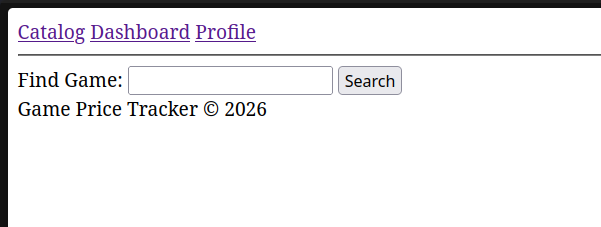
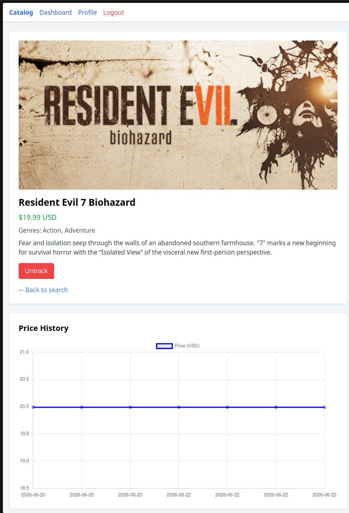

# Game Price Tracker

Отслеживание цен на игры в Steam с уведомлениями в Telegram и Email.

Web: http://212.108.82.148:8080/
Telegram: @GamePriceTrackerTelegramBot

## Функциональность

- **Поиск игр** через Steam (HTML-парсинг + API).
- **График цен** на странице игры (Chart.js).
- **Уведомления** при падении цены ниже целевой (Email + Telegram).
- **Telegram-бот** с набором команд:
    - `/start` — начало работы.
    - `/search` — поиск игр.
    - `/track` — добавить в отслеживание.
    - `/list` — список отслеживаемых игр.
    - `/price` — текущая цена.
    - `/set` — установить целевую цену.
    - `/untrack` — удалить из отслеживания.
    - `/notify` — отмена последней команды.
    - `/cancel` — настройка уведомлений.
    - `/email` — привязка email с верификацией.
    - `/help` — список доступных команд.
- **Email-уведомления** через очереди (Redis).
- **История цен** и график изменения.
- **Веб-интерфейс** на Blade с аутентификацией (Breeze).
- **Docker** — запуск одной командой.

## Стек

- **Backend:** Laravel 13, PHP 8.5
- **Database:** PostgreSQL 16
- **Queue/Cache:** Redis
- **Frontend:** Blade, Chart.js
- **Bot:** Telegram Bot API
- **API:** Steam (appdetails + HTML-парсинг)
- **Deploy:** Docker, Docker Compose, Nginx, Supervisor

## Скриншоты

Каталог

Страница игры

Telegram-бот

Dashboard

## Быстрый старт (локально)

\`\`\`bash
git clone https://github.com/khantuevandrei/game-price-tracker.git
cd game-price-tracker
cp .env.example .env

## Заполни .env (TELEGRAM_BOT_TOKEN обязательно)

docker compose up -d --build
docker compose exec app php artisan migrate
docker compose exec app php artisan key:generate
\`\`\`

Открыть: `http://localhost:8080`

## Команды Artisan

| Команда                | Описание                          |
| ---------------------- | --------------------------------- |
| `prices:fetch`         | Обновление цен из Steam API       |
| `app:telegram-polling` | Обработка сообщений Telegram-бота |

## Архитектура

\`\`\`
Web (Blade) -> Controller -> Service -> Steam API
Telegram Bot -> TelegramPolling -> Service -> Steam API
Cron -> FetchPrices -> Steam API -> PriceHistory
Queue -> SendPriceAlert -> Email / Telegram
\`\`\`
