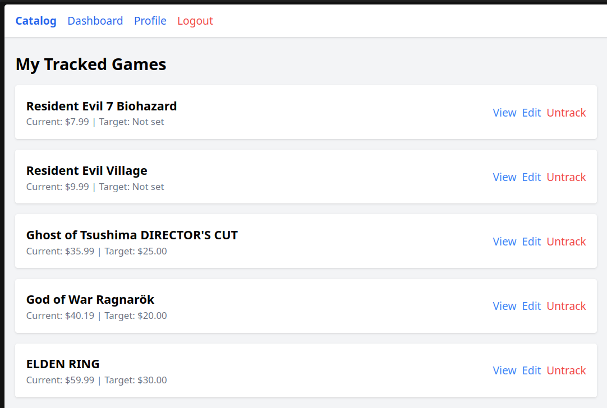
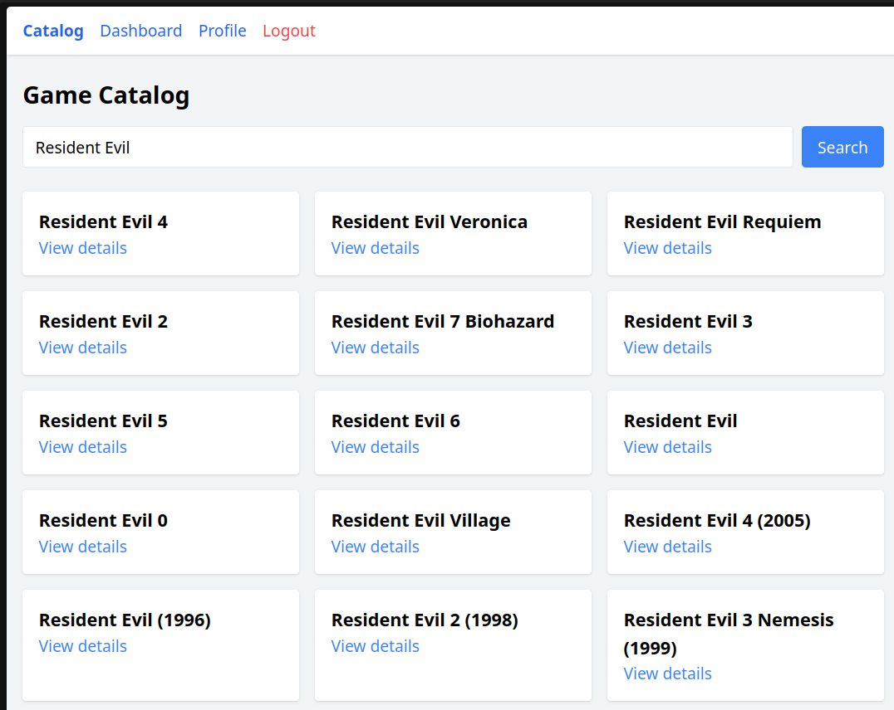

# Game Price Tracker

[](https://github.com/khantuevandrei/game-price-tracker/actions/workflows/ci.yml)
[](https://github.com/khantuevandrei/game-price-tracker/actions/workflows/deploy.yml)


Отслеживание цен на игры в Steam с уведомлениями на email и в Telegram, когда цена падает до целевой.

🇬🇧 [English version](README.md)

## 🎮 Live Demo

- **Веб-приложение:** [steam.khantuev.dev](https://steam.khantuev.dev)
- **Telegram-бот:** [@GamePriceTrackerTelegramBot](https://t.me/GamePriceTrackerTelegramBot)

Демо-аккаунт для быстрой проверки:

- Email: `demo@khantuev.dev`
- Пароль: `demo1234`

## Скриншоты

<p align="center">
  
  <br><em>Дашборд — отслеживаемые игры с текущей и целевой ценой</em>
</p>

<p align="center">
  
  <br><em>Поиск — любая игра из каталога Steam</em>
</p>

<p align="center">
  
  <br><em>Уведомление в Telegram, когда цена отслеживаемой игры упала</em>
</p>

## Возможности

- 🔍 Поиск игр в каталоге Steam
- 📊 История изменения цены по каждой отслеживаемой игре
- 🎯 Установка целевой цены — уведомление, когда цена упадёт ниже
- 📧 Транзакционные email-уведомления через Resend (свой домен, подпись DKIM/SPF)
- 🤖 Telegram-бот: `/search`, `/list`, `/track`, `/untrack`
- 📈 Автоматическое обновление цен раз в час через Laravel Scheduler
- 🔐 Аутентификация Laravel Breeze + подтверждение email

## Технологический стек

**Backend:** Laravel 11, PHP 8.5, PostgreSQL 16, Redis
**Frontend:** Blade, Tailwind CSS, Alpine.js
**Инфраструктура:** Docker Compose, Caddy (reverse proxy + автоматический HTTPS), Ubuntu VPS
**Тесты и CI/CD:** PHPUnit, Laravel Pint, GitHub Actions
**Внешние API:** Steam Web API, Telegram Bot API, Resend

## Архитектура

```
        ┌──────────────┐
        │ Пользователь │
        └──────┬───────┘
               │ HTTPS
        ┌──────▼───────┐
        │    Caddy     │  ← Let's Encrypt авто-обновление
        └──────┬───────┘
               │
        ┌──────▼───────┐         ┌────────────────┐
        │   Laravel    │ ─────▶️ │  Steam API     │
        │  (Docker)    │ ─────▶️ │  Telegram API  │
        │              │ ─────▶️ │  Resend        │
        └──────┬───────┘         └────────────────┘
               │
     ┌─────────┼─────────┐
     ▼         ▼         ▼
 ┌────────┐ ┌───────┐ ┌──────────┐
 │Postgres│ │ Redis │ │Scheduler │
 └────────┘ └───────┘ └──────────┘
```

## Локальный запуск

```bash
git clone https://github.com/khantuevandrei/game-price-tracker.git
cd game-price-tracker
cp .env.example .env
docker compose up -d --build
docker compose exec app php artisan key:generate
docker compose exec app php artisan migrate
```

Приложение доступно по `http://localhost:8080`.

### Обязательные переменные окружения

```env
APP_URL=http://localhost:8080

DB_CONNECTION=pgsql
DB_HOST=postgres
DB_DATABASE=game_price_tracker
DB_USERNAME=laravel
DB_PASSWORD=your_password

REDIS_HOST=redis

TELEGRAM_BOT_TOKEN=токен_вашего_бота

MAIL_MAILER=resend
RESEND_KEY=ваш_resend_api_key
MAIL_FROM_ADDRESS=noreply@yourdomain.com
MAIL_FROM_NAME="Game Price Tracker"
```

## Тесты

```bash
docker compose exec app php artisan test
```

37 тестов: auth-флоу, интеграция со Steam API, трекинг игр, Telegram-бот.

## Стиль кода

```bash
docker compose exec app vendor/bin/pint
```

Laravel Pint (PSR-12). Автоматически проверяется в CI при каждом push.

## Деплой

Push в `main` → GitHub Actions гоняет тесты + линт → при успехе автоматический деплой на VPS через SSH → `git pull` + пересборка контейнеров + кеш config/routes/views.

Продакшен: [steam.khantuev.dev](https://steam.khantuev.dev), self-managed Ubuntu VPS, Caddy с автоматическим HTTPS через Let's Encrypt.

## Лицензия

MIT
